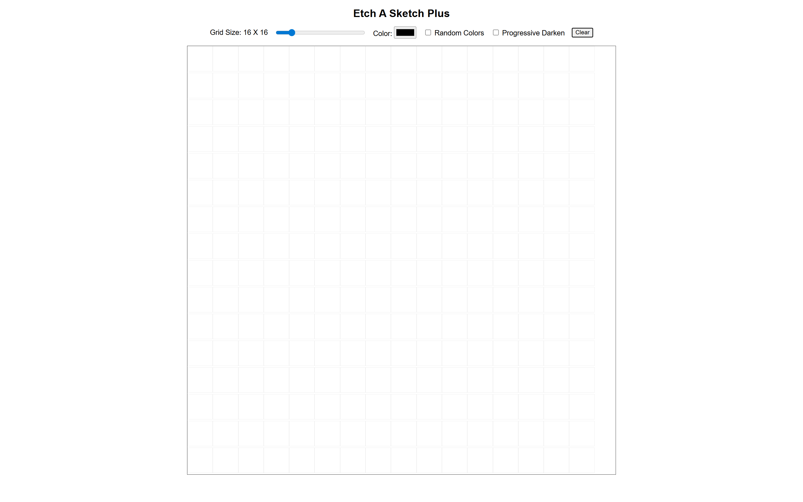

# Etch-A-Sketch Plus  

A modern, responsive browser-based “Etch-A-Sketch” toy built as part of [The Odin Project – Foundations Course](https://www.theodinproject.com/lessons/foundations-etch-a-sketch).  
It lets you draw pixel-art with your mouse or touch, adjust grid density live, and experiment with random colors or progressive darkening effects.

---

## Live Demo  
[**Open on Netlify**](https://your-netlify-link-here) 
---

## Features  

- **Live Grid Size Slider** – Adjust between 1×1 and 100×100 squares instantly.  
- **Color Picker** – Choose any color for drawing.  
- **Random Color Mode** – Each cell gets a random color on hover.  
- **Progressive Darken Mode** – Each hover darkens a cell by 10 % until black.  
- **Clear Button** – Wipe the board without reloading.  

---

## File Structure  

```bash
etch-a-sketch/
├── index.html
├── style.css
├── script.js
├── README.md
└── images/
    └── etch-a-sketch.png
```

---

## Lessons Learned  

- How to dynamically create and style grid elements using JavaScript and Flexbox.  
- How to use **event listeners** to change element styles on hover.  
- How to implement **random color generation** and **progressive darkening** using `dataset` attributes and CSS opacity.   
- Practice in writing cleaner, modular JavaScript for DOM manipulation.  

---

## Acknowledgment  

- [The Odin Project](https://www.theodinproject.com/) for the assignment and guidance.  
- MDN Web Docs for references on JavaScript, CSS Flexbox, and the `opacity` property.  
- Community discussions and open-source examples that inspired additional features.  

---

## Future Improvements  

- Add **touch support** for mobile drawing.  
- Add **save as image** feature.  
- Add **eraser** mode.  
- Add **keyboard shortcuts** for faster toggling.
